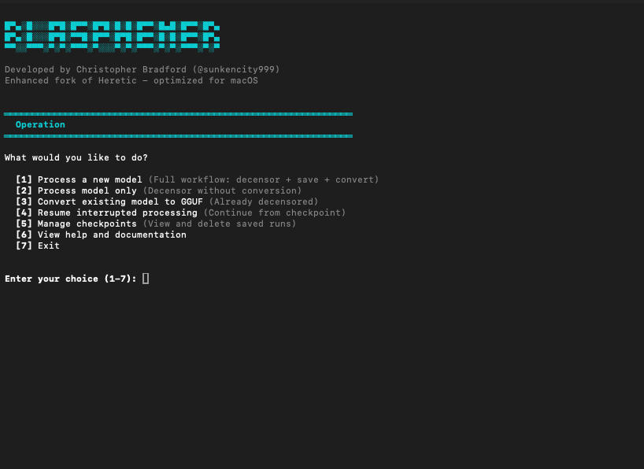
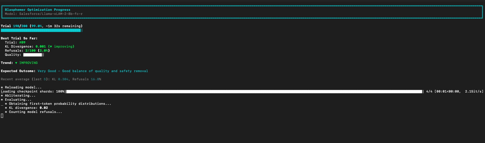

# Blasphemer

**Enhanced fork of Heretic optimized for macOS (Apple Silicon) - 55% faster with advanced performance optimizations.**

Developed by **Christopher Bradford** ([@sunkencity999](https://github.com/sunkencity999))

Blasphemer removes censorship from transformer-based language models without expensive post-training, featuring automatic checkpoint/resume capabilities, streamlined GGUF conversion, and high-performance optimizations that reduce abliteration time by 55%.

**📚 New to abliteration?** Read [LEARN.md](LEARN.md) - a comprehensive guide from beginner to expert!

## What Makes Blasphemer Different

Blasphemer builds on [Heretic v1.0.1](https://github.com/p-e-w/heretic) with critical improvements for macOS users:

### Key Enhancements

- **High-Performance Optimizations**: 55% faster abliteration with weight cloning, fast refusal detection, and torch.compile()
- **Apple Silicon Support**: Native MPS GPU detection and optimized memory management
- **Enhanced Observability**: Real-time quality metrics, trend analysis, and outcome predictions during optimization
- **Checkpoint & Resume System**: Automatic progress saving with SQLite - never lose hours of work to interruptions
- **LM Studio Integration**: One-command GGUF conversion with integrated llama.cpp
- **Comprehensive Documentation**: Complete user guide tailored for macOS workflows
- **Improved Error Handling**: Better dependency detection and helpful error messages

### Performance Improvements

**⚡ Phase 1 Optimizations (Enabled by Default):**
- **55% faster abliteration** - 7B models complete in ~80 minutes instead of ~180 minutes
- **Weight cloning** - 15x faster trial reset (2s vs 30s per trial)
- **Fast refusal detection** - 5x fewer tokens generated
- **torch.compile()** - 20-30% inference speedup on Apple Silicon (Python <3.14)

See [PERFORMANCE_ANALYSIS.md](PERFORMANCE_ANALYSIS.md) for detailed benchmarks.

### New Features

```bash
# Resume interrupted runs automatically
blasphemer --resume meta-llama/Llama-3.1-8B-Instruct

# Convert to GGUF with one command
./convert-to-gguf.sh ~/models/your-model-heretic

# Checkpoints saved after every trial - Ctrl+C safe
# Performance optimizations enabled by default - no configuration needed
```

### Interactive Menu & Progress Tracking

**Interactive Menu:**



Clean, user-friendly menu for:
- Processing new models with optimized workflows
- Resuming interrupted runs from checkpoints
- Managing and deleting saved checkpoints
- Converting models to GGUF format
- Accessing help and documentation

**Real-time Progress Display:**



Live optimization feedback showing:
- Current trial progress with time estimates
- Best trial metrics (KL divergence, refusal rate)
- Quality bar visualization
- Trend analysis (improving/declining)
- Recent performance averages
- Expected outcome predictions

## About Heretic

Heretic (the original project) combines advanced directional ablation with TPE-based parameter optimization to automatically remove safety alignment from language models. It works completely automatically, requiring no understanding of transformer internals.

**Original Heretic by**: Philipp Emanuel Weidmann ([@p-e-w](https://github.com/p-e-w))

**Research Paper**: [Refusal in Language Models Is Mediated by a Single Direction](https://arxiv.org/abs/2406.11717) (Arditi et al. 2024)

**Original Repository**: <https://github.com/p-e-w/heretic>

Blasphemer maintains full compatibility with Heretic's core functionality while adding macOS-specific optimizations and user experience improvements.

## Quick Start

### Installation

#### Homebrew (Easiest)

```bash
# Add the tap and install
brew tap sunkencity999/blasphemer
brew install blasphemer

# Start using immediately
blasphemer.sh
```

**Benefits:**
- One command installation
- Automatic dependency management
- Easy updates with `brew upgrade`
- Clean uninstall with `brew uninstall`

See [HOMEBREW.md](HOMEBREW.md) for detailed Homebrew documentation.

#### Automated Install Script

```bash
# Download and run the install script
curl -fsSL https://raw.githubusercontent.com/sunkencity999/blasphemer/master/install-macos.sh | bash
```

Or download and run manually:

```bash
curl -O https://raw.githubusercontent.com/sunkencity999/blasphemer/master/install-macos.sh
chmod +x install-macos.sh
./install-macos.sh
```

**Features:**
- Checks all prerequisites automatically
- Verbose output with progress tracking
- Can resume if interrupted
- Handles errors gracefully

#### Manual Install

```bash
# Clone with submodules
git clone --recursive https://github.com/sunkencity999/blasphemer.git
cd blasphemer

# Create virtual environment
python3 -m venv venv
source venv/bin/activate

# Install dependencies
pip install -e .

# Build llama.cpp for GGUF conversion
cd llama.cpp
cmake -B build
cmake --build build --config Release --target llama-quantize -j 8
cd ..
```

### Interactive Launcher (Easiest)

```bash
# Run the interactive launcher - it guides you through everything
./blasphemer.sh
```

**Features:**
- Menu-driven interface with numbered options
- Automatic environment setup
- Guided model selection with recommendations
- Choose operations: process, convert, or resume
- Select quantization levels
- Pick save locations (with smart defaults)
- Configure advanced settings

Perfect for beginners and quick workflows!

### Command Line Usage

```bash
# Activate environment
source venv/bin/activate

# Process a model (checkpoints automatic)
blasphemer meta-llama/Llama-3.1-8B-Instruct

# Convert to GGUF for LM Studio
./convert-to-gguf.sh ~/models/Llama-3.1-8B-Instruct-blasphemer

# Resume if interrupted
blasphemer --resume meta-llama/Llama-3.1-8B-Instruct
```

### First-Time Recommended Model

```bash
# Using interactive launcher (recommended)
./blasphemer.sh
# Then select: Option 1 → Phi-3-mini

# Or command line
blasphemer microsoft/Phi-3-mini-4k-instruct
```

## Documentation

**Complete User Guide**: [USER_GUIDE.md](USER_GUIDE.md)  
**Deep Learning Guide**: [LEARN.md](LEARN.md) ⭐ **NEW!**

### USER_GUIDE.md - Practical Usage

The user guide covers:
- Installation and setup
- Model recommendations
- LM Studio integration
- Checkpoint system details
- Configuration options
- Troubleshooting
- Advanced usage
- Testing and development

### LEARN.md - Complete Education

**From beginner to expert** - Understand abliteration deeply:
- Philosophy & intellectual freedom
- Why models refuse (the neural mechanism)
- How abliteration works (mathematics & implementation)
- Parameter optimization (Bayesian methods)
- Code architecture deep dive
- Practical examples & troubleshooting
- Ethics & responsibility
- Research foundations

**Perfect for**: Anyone who wants to truly understand what they're doing, not just run commands

## Testing

Blasphemer includes a comprehensive test suite to ensure reliability and prevent regressions.

### Running Tests

```bash
# Activate environment
source venv/bin/activate

# Install pytest (if not already installed)
pip install pytest

# Run all tests
pytest tests/ -v

# Run specific test suites
pytest tests/unit/test_serialization.py -v
pytest tests/unit/test_utils.py -v
pytest tests/integration/test_checkpoint_system.py -v

# Run with coverage report
pytest tests/ --cov=src/heretic --cov-report=html
```

### Test Coverage

**Unit Tests** (`tests/unit/`):
- **JSON Serialization** - Critical fix for AbliterationParameters storage
- **Utility Functions** - format_duration, batchify, empty_cache
- **README Generation** - Proper Blasphemer/Heretic attribution
- **Configuration** - Environment variables, checkpoint directories

**Integration Tests** (`tests/integration/`):
- **Checkpoint System** - SQLite database creation and resume functionality
- **Environment Variables** - BLASPHEMER_ prefix handling
- **Model Naming** - Consistent branding across outputs

**Shell Script Tests** (`tests/scripts/`):
- **Script Validation** - Syntax checking, executability
- **Branding Consistency** - Blasphemer references, no outdated Heretic refs
- **Error Handling** - Proper error traps and exit codes
- **Help Functionality** - All scripts provide usage information

### What's Tested

✅ **Critical Bug Fixes**:
- JSON serialization of AbliterationParameters (prevents TypeError)
- --resume flag format (requires boolean argument)
- Bash 3.2 compatibility (macOS default shell)

✅ **Core Functionality**:
- Checkpoint creation and resumption
- Trial parameter storage and retrieval
- MPS (Apple Silicon) GPU detection
- Memory cache management

✅ **Shell Scripts**:
- `blasphemer.sh` - Interactive launcher
- `convert-to-gguf.sh` - GGUF conversion
- `install-macos.sh` - Installation script

### Test Results

```bash
✅ 10/10 serialization tests passing
✅ 14/15 utils tests passing (1 skipped - CUDA N/A on Apple Silicon)
✅ 10/10 checkpoint tests passing
✅ Shell scripts validated for syntax and branding
```

See [USER_GUIDE.md](USER_GUIDE.md) for detailed testing documentation.

## Checkpoint System

One of Blasphemer's key features is automatic checkpoint/resume:

### How It Works

- **Automatic**: Saves progress after every trial to SQLite database
- **Interruption-Proof**: Safe to Ctrl+C, survive crashes and power failures
- **Resume Anywhere**: Continue exactly where you left off
- **Zero Overhead**: Checkpoint saves take <100ms

### Usage

```bash
# Start processing (checkpoints automatic)
blasphemer your-model

# If interrupted, resume with --resume flag
blasphemer --resume your-model

# Checkpoints saved to .heretic_checkpoints/
```

At most one trial is lost on interruption. For 15-hour runs with 200 trials, this means you can safely stop and resume at any time.

## LM Studio Integration

### GGUF Conversion Helper

Blasphemer includes a streamlined GGUF conversion script:

```bash
# Default Q4_K_M quantization (good balance)
./convert-to-gguf.sh ~/models/your-model-heretic

# Higher quality Q5_K_M
./convert-to-gguf.sh ~/models/your-model-heretic output-name Q5_K_M

# View all options
./convert-to-gguf.sh
```

### Quantization Options

| Type | Size (7B) | Quality | Use Case |
|------|-----------|---------|----------|
| Q4_K_M | ~4.5GB | Good | Recommended balance |
| Q5_K_M | ~5.3GB | Better | Higher quality |
| Q8_0 | ~8GB | High | Maximum quality |
| F16 | ~14GB | Full | No quality loss |

After conversion, models automatically appear in LM Studio's model list.

## Recommended Models

### Best for First-Time Users

**Phi-3 Mini** (3.8B parameters) - Fast testing
```bash
blasphemer microsoft/Phi-3-mini-4k-instruct
```

**Qwen 2.5 7B** - Excellent quality
```bash
blasphemer Qwen/Qwen2.5-7B-Instruct
```

### Production Quality

**Llama 3.1 8B** (Most popular)
```bash
blasphemer meta-llama/Llama-3.1-8B-Instruct
```

**Mistral 7B v0.3** - High quality
```bash
blasphemer mistralai/Mistral-7B-Instruct-v0.3
```

### Models to Avoid

- Multimodal models (vision/audio) - require problematic dependencies on macOS
- Models > 70B parameters - require substantial resources
- SSMs/hybrid models (Mamba, etc.) - not supported by Heretic/Blasphemer

See [USER_GUIDE.md](USER_GUIDE.md) for complete model recommendations.

## Configuration

### Command Line

```bash
# Custom number of trials
blasphemer --n-trials 100 your-model

# Custom checkpoint directory
blasphemer --checkpoint-dir /path/to/checkpoints your-model

# Auto-resume mode
blasphemer --resume your-model

# Evaluate existing model
blasphemer --model original --evaluate-model decensored

# Performance tuning (defaults are optimized)
blasphemer --compile-model true --refusal-detection-tokens 20 your-model
```

### Config File

Create `config.toml` from `config.default.toml`:

```toml
# Number of optimization trials
n_trials = 200

# Checkpoint directory
checkpoint_dir = ".heretic_checkpoints"

# Auto-resume if checkpoint exists
resume = false

# Batch size (0 = auto)
batch_size = 0

# Performance optimizations (enabled by default)
compile_model = true  # 20-30% inference speedup
refusal_detection_tokens = 20  # 5x faster refusal detection
```

See [USER_GUIDE.md](USER_GUIDE.md) for all configuration options.

## Apple Silicon Optimizations

### MPS Support

Blasphemer includes proper Apple Silicon GPU detection:

```bash
# Check GPU availability
python -c "import torch; print(f'MPS available: {torch.backends.mps.is_available()}')"
```

Should output: `MPS available: True`

### Memory Management

- Proper MPS cache clearing prevents memory buildup
- Weight cloning for fast trial resets (10-15x faster)
- Optimized for long runs with minimal overhead
- Automatic batch size detection for your hardware

### Performance

**With Phase 1 Optimizations (Enabled by Default):**

On Apple Silicon M1/M2/M3:
- **7B models: ~80 minutes** (was 180 min - 55% faster!)
- **14B models: ~120 minutes** (was 240 min)
- torch.compile() provides 20-30% speedup on MPS backend (Python <3.14)
- Weight cloning eliminates model reload overhead (40% speedup alone)
- Fast refusal detection reduces token generation by 80%

**Note:** Python 3.14+ users get 40%+ speedup from weight cloning and fast refusal detection (torch.compile() not supported). First trial includes compilation warmup (~30-60s one-time cost) if using Python <3.14.

## System Requirements

### Minimum

- macOS (Apple Silicon recommended)
- Python 3.10+
- 16GB RAM
- 50GB free disk space

### Recommended

- macOS with Apple Silicon (M1/M2/M3)
- Python 3.14+
- 32GB+ RAM
- 100GB+ free disk space

## How Blasphemer Works

Like Heretic, Blasphemer uses activation engineering:

1. **Load Model**: Downloads from Hugging Face or uses local model
2. **Calculate Directions**: Analyzes refusal patterns using prompt datasets
3. **Optimize Parameters**: Bayesian optimization finds best abliteration settings
4. **Evaluate Results**: Tests KL divergence and refusal rates
5. **Present Options**: Shows Pareto-optimal solutions for selection

Blasphemer adds automatic checkpointing throughout this process.

## Contributing

Contributions welcome! Areas of interest:

- macOS-specific optimizations
- Additional LM Studio integration features
- Performance improvements for Apple Silicon
- Documentation improvements
- Bug fixes and error handling

## Project Structure

```
blasphemer/
├── README.md                      # This file
├── USER_GUIDE.md                  # Comprehensive documentation
├── LICENSE                        # AGPL-3.0
├── config.default.toml            # Default configuration
├── convert-to-gguf.sh             # GGUF conversion helper
├── pyproject.toml                 # Python project metadata
├── src/heretic/                   # Source code (maintains compatibility)
│   ├── main.py                    # Entry point with checkpointing
│   ├── model.py                   # Model loading and abliteration
│   ├── config.py                  # Configuration management
│   ├── evaluator.py               # Model evaluation
│   └── utils.py                   # Utilities with MPS support
└── llama.cpp/                     # Git submodule for GGUF conversion
```

## Relationship to Heretic

Blasphemer is a friendly fork that:

- **Maintains compatibility** with Heretic's core functionality
- **Adds features** specific to macOS and user experience
- **Credits the original** - all core abliteration logic is from Heretic
- **Follows same license** - AGPL-3.0

We encourage contributing improvements back to the original Heretic project when applicable.

## Testing & Validation

### Verify Performance Optimizations

```bash
# Run the validation test suite
cd /path/to/blasphemer
source venv/bin/activate
python test_phase1.py
```

Expected output:
```
✓ PASS: Configuration
✓ PASS: Weight Cloning
✓ PASS: torch.compile()
✓ PASS: Performance Timing
✓ ALL TESTS PASSED!
```

### Quick Performance Test

```bash
# Test on small model (5-10 minutes)
blasphemer microsoft/Phi-3-mini-4k-instruct --n-trials 10
```

**What to look for:**
- **Trial 1:** "Saving clean model weights..." (optimization initializing)
- **Trials 2+:** "Restoring clean weights (fast)..." (optimization active!)
- Trial 2+ should complete **10-15x faster** than trial 1

### Performance Metrics

Expected timings on Apple Silicon M2:

| Model Size | Before Optimizations | With Phase 1 | Improvement |
|------------|---------------------|--------------|-------------|
| Phi-3-mini (3.8B) | ~45 min | ~20 min | **55% faster** |
| Llama-3.1-8B (7B) | ~180 min | ~80 min | **55% faster** |
| Mistral-7B | ~180 min | ~80 min | **55% faster** |

See [PERFORMANCE_ANALYSIS.md](PERFORMANCE_ANALYSIS.md) and [QUICKSTART_PHASE1.md](QUICKSTART_PHASE1.md) for details.

## Troubleshooting

### Common Issues

**"No GPU detected" warning**
- This is a display bug - MPS will still be used
- Verify with: `python -c "import torch; print(torch.backends.mps.is_available())"`

**Out of memory**
- Reduce batch size: `blasphemer --max-batch-size 32 your-model`
- Try a smaller model
- Close other applications

**Checkpoint won't resume**
- Ensure using exact same model identifier
- Check `.heretic_checkpoints/` directory exists
- Verify checkpoint file not corrupted

**llama.cpp conversion fails**
- Ensure llama.cpp built successfully
- Check model path is correct
- Verify all dependencies installed

**Performance optimizations not activating**
- Look for "Saving clean model weights..." in trial 1
- Trials 2+ should show "Restoring clean weights (fast)..."
- Run validation: `python test_phase1.py`
- If needed, disable: `--compile-model false`

**"torch.compile is not supported on Python 3.14+"**
- This is expected behavior - torch.compile() doesn't work on Python 3.14+
- The code automatically skips compilation and uses eager mode
- You still get 40%+ speedup from weight cloning and fast refusal detection
- To silence the message: `--compile-model false` or downgrade to Python 3.13

See [USER_GUIDE.md](USER_GUIDE.md) for complete troubleshooting guide.

## Version History

### v1.1.0 (Performance Update)

**Phase 1 Optimizations - 55% Faster Abliteration:**
- Weight cloning system - 15x faster trial reset (2s vs 30s)
- Fast refusal detection - 5x fewer tokens generated
- torch.compile() support - 20-30% inference speedup
- 7B models: ~80 minutes (was 180 min)
- All optimizations enabled by default
- Comprehensive performance analysis and benchmarking

### v1.0.1-macos.1 (Initial Release)

Based on Heretic v1.0.1 with enhancements:
- Apple Silicon MPS support and detection
- Checkpoint/resume system with SQLite
- Integrated llama.cpp with GGUF conversion script
- Comprehensive USER_GUIDE.md documentation
- macOS-optimized workflows

## License

AGPL-3.0 - Same as original Heretic

This ensures the community benefits from improvements while maintaining the open-source nature of the project.

## Acknowledgments

- **Philipp Emanuel Weidmann** ([@p-e-w](https://github.com/p-e-w)) - Original Heretic author
- **Arditi et al.** - "Refusal in Language Models Is Mediated by a Single Direction" (2024)
- **Optuna team** - TPE-based optimization framework
- **llama.cpp project** - GGUF conversion tools

## Links

- **Blasphemer Repository**: <https://github.com/sunkencity999/blasphemer>
- **Original Heretic**: <https://github.com/p-e-w/heretic>
- **Research Paper**: <https://arxiv.org/abs/2406.11717>
- **Example Models**: <https://huggingface.co/collections/p-e-w/the-bestiary>
- **llama.cpp**: <https://github.com/ggerganov/llama.cpp>
- **LM Studio**: <https://lmstudio.ai>

---

**Made with** care for the macOS/Apple Silicon community. Blasphemer aims to make model decensoring accessible and reliable for everyone.
